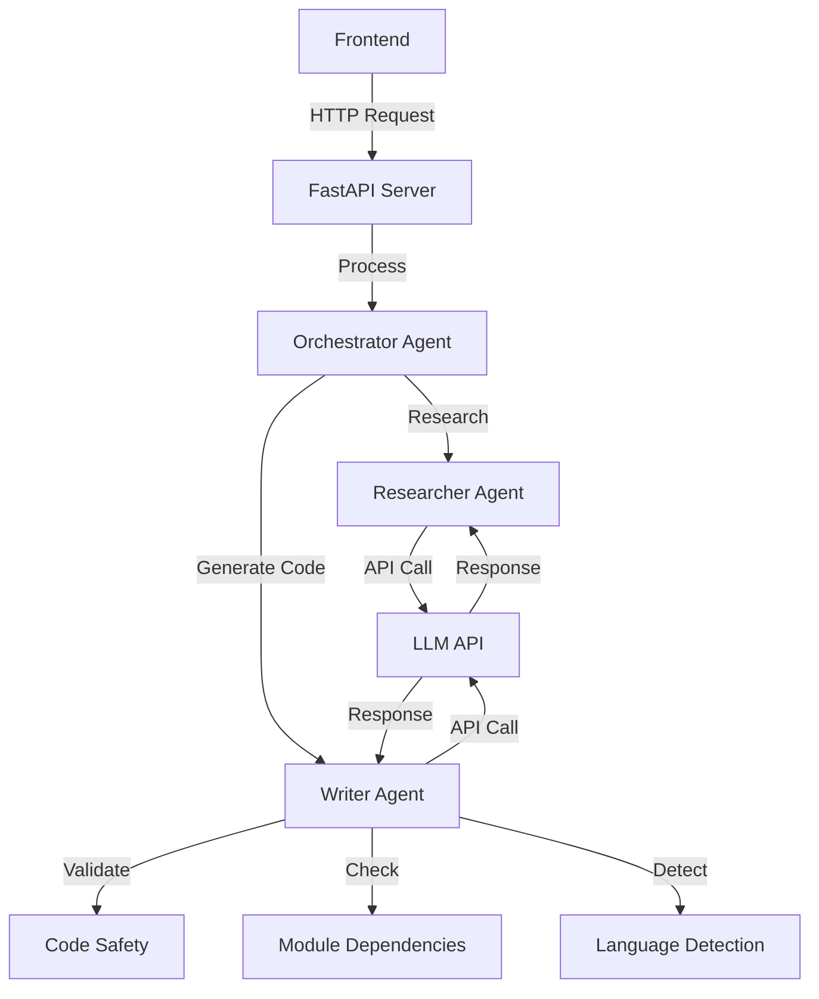
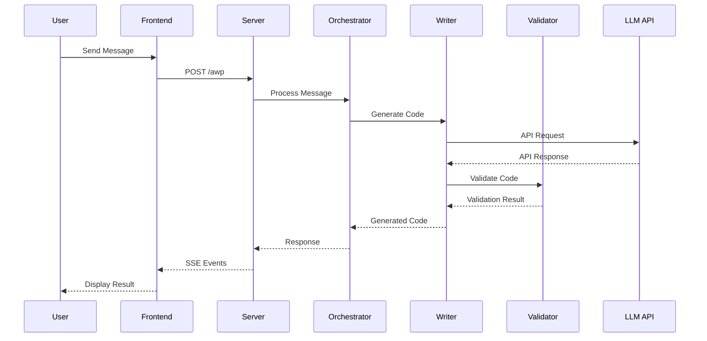
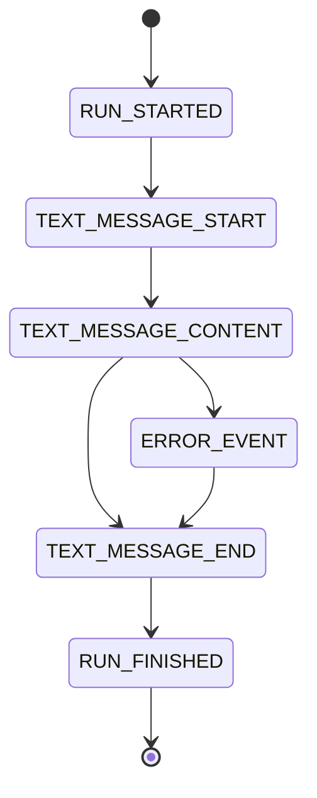
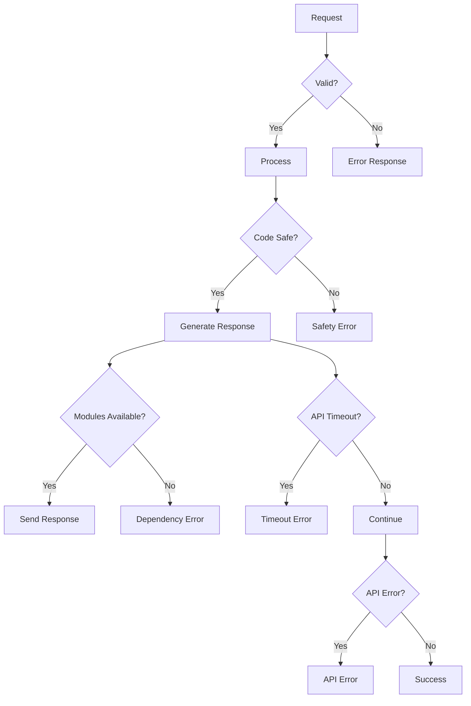

# AG-UI Test Application Documentation

## Purpose
This application was created via pure vibe-coding using Cursor.  I created it with the intention
of using this code to learn how AG_UI fits into the Agent Architecture.  The documentation.md 
is the actual output, as that served as my study guide once the code was generated.  In this way
I was able to quickly use this simple prototype to understand how AG_UI works.

## Overview
This application implements the Agent User Interaction Protocol (AG-UI) for generating Python scripts. It features a multi-agent system with robust code generation, safety validation, and language detection capabilities.

## System Components



## Configuration

### Environment Setup
- Requires `.env` file in the application root
- Environment variables for LLM configuration:
  - `LLM_API_KEY`: API key for cloud endpoints
  - `LLM_ENDPOINT`: API endpoint URL
  - `LLM_MODEL`: Model name to use
  - `LLM_IS_LOCAL`: Boolean flag for local endpoint

### LLM Configuration
- Supports both local and cloud endpoints
- Configurable timeout settings:
  - Response timeout: 300 seconds
  - Connect timeout: 10 seconds
  - Read timeout: 600 seconds
  - Write timeout: 10 seconds
- Connection limits:
  - Max keepalive connections: 5
  - Max total connections: 10
- Retry logic: 3 attempts for failed requests

## Enhanced Features

### Code Generation
- **Smart Code Templates**: Pre-defined templates for common requests
- **Dynamic Code Generation**: Custom code generation for specific requirements
- **Markdown Formatting**: Properly formatted code blocks with language specification
- **Multi-line Support**: Preserves code formatting and indentation
- **Main Guard**: Includes `if __name__ == "__main__":` pattern
- **Error Handling**: Comprehensive try-except blocks

### Safety Features
- **AST Validation**: Syntax validation using Python's Abstract Syntax Tree
- **Dangerous Operation Detection**: Blocks potentially harmful code patterns
- **Module Dependency Checking**: Verifies required modules are available
- **Requirement Validation**: Ensures generated code meets user requirements
- **Timeout Protection**: Prevents hanging on long-running operations
- **Connection Limits**: Prevents resource exhaustion

### Language Detection
- **Multi-language Support**: Detects Python, JavaScript, and C#
- **Pattern Recognition**: Identifies language based on syntax patterns
- **Code Block Extraction**: Properly extracts code from markdown blocks
- **Language Specification**: Maintains language context in responses

## Message Flow



## Event Types



## Error Handling



## Frontend Components
- **Message Display**: Real-time message updates
- **Code Formatting**: Syntax highlighting for code blocks
- **Error Handling**: Clear error message display
- **Streaming Support**: Server-Sent Events (SSE) implementation

## Backend Components

### Orchestrator Agent
- Coordinates between agents
- Manages workflow
- Routes simple requests directly to Writer
- Handles complex requests with research phase
- Manages message ID generation
- Handles SSE event streaming

### Researcher Agent
- Provides best practices
- Suggests patterns
- Analyzes requirements
- Supports code generation decisions
- Manages LLM API interactions
- Handles API timeouts and retries

### Writer Agent
- Generates code based on requirements
- Validates code safety
- Checks module dependencies
- Detects programming language
- Formats code with markdown
- Implements retry logic
- Manages LLM API interactions
- Handles API timeouts and retries

## Event Flow
1. User sends message
2. Server receives request
3. Generate unique message ID
4. Send RUN_STARTED event
5. Send TEXT_MESSAGE_START event
6. Orchestrator processes message
7. Writer generates and validates code
8. Send TEXT_MESSAGE_CONTENT events
9. Send TEXT_MESSAGE_END event
10. Send RUN_FINISHED event
11. Frontend displays formatted result

## Request Format
```json
{
    "thread_id": "uuid",
    "run_id": "uuid",
    "messages": [
        {
            "role": "user",
            "content": "message content"
        }
    ]
}
```

## Error Handling
- Syntax validation errors
- Safety check failures
- Missing module dependencies
- Invalid language detection
- Stream processing errors
- LLM API timeouts
- LLM API connection errors
- Environment configuration errors
- Invalid message format errors

## Setup Instructions
1. Install dependencies: `pip install -r requirements.txt`
2. Create `.env` file with required configuration
3. Start server: `python main.py`
4. Access frontend: `http://localhost:8000`

## Future Improvements
- Enhanced language detection
- Additional code templates
- Extended safety checks
- Improved error messages
- Better code formatting
- Enhanced timeout handling
- Improved retry logic
- Better environment validation

## Contributing
1. Fork the repository
2. Create feature branch
3. Commit changes
4. Push to branch
5. Create Pull Request

## License
MIT License - See LICENSE file for details 