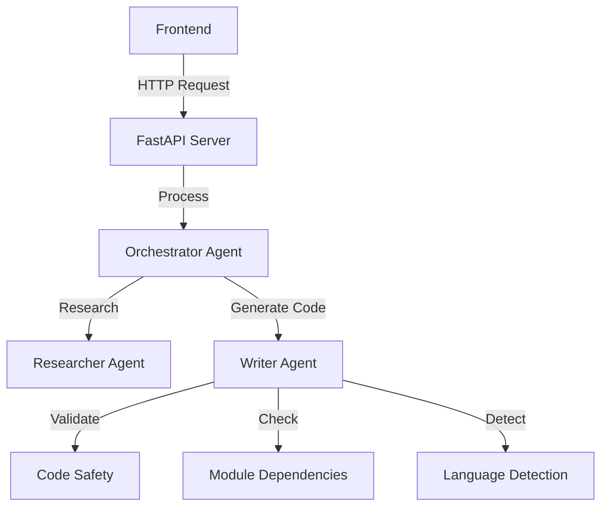
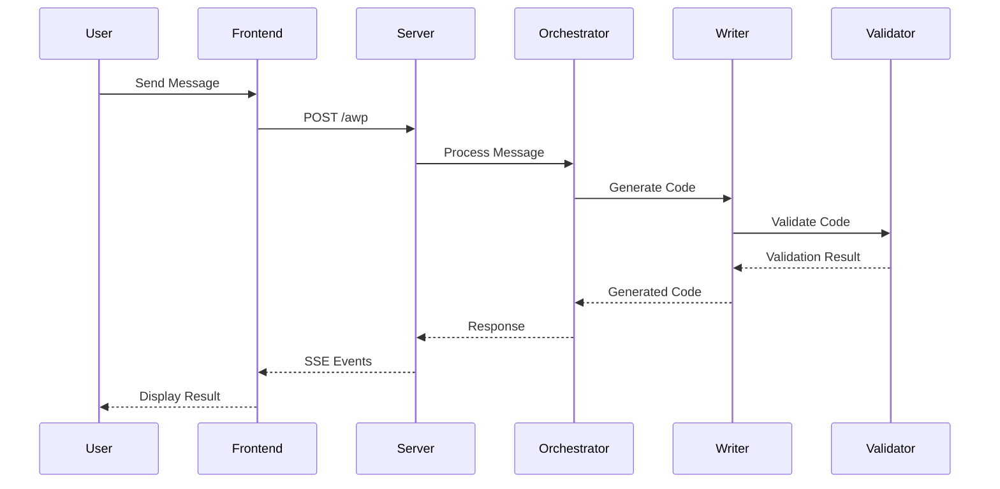
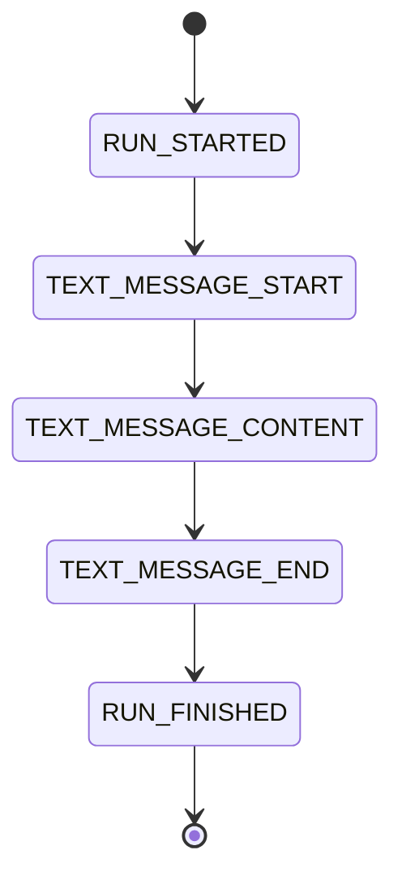
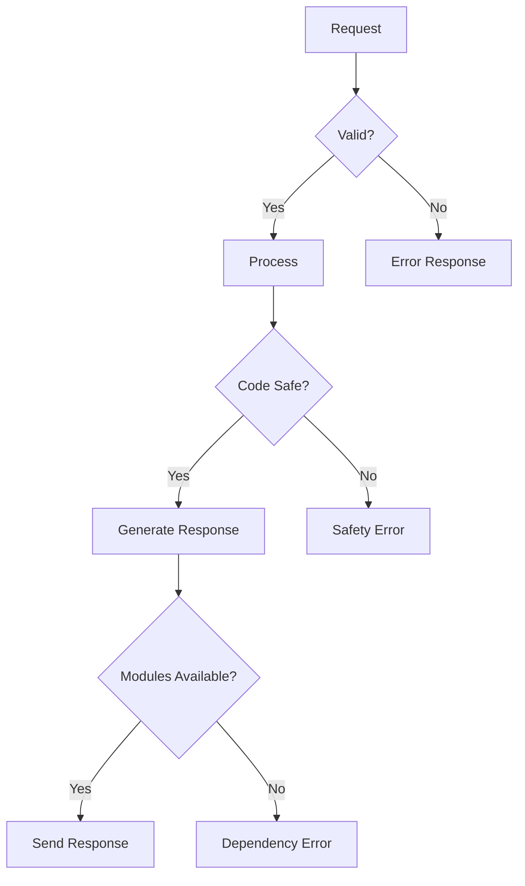

# AG-UI Test Application Documentation

## Overview
This application implements the Agent User Interaction Protocol (AG-UI) for generating Python scripts. It features a multi-agent system with robust code generation, safety validation, and language detection capabilities. Test.

## System Components



## Enhanced Features

### Code Generation
- **Smart Code Templates**: Pre-defined templates for common requests
- **Dynamic Code Generation**: Custom code generation for specific requirements
- **Markdown Formatting**: Properly formatted code blocks with language specification
- **Multi-line Support**: Preserves code formatting and indentation

### Safety Features
- **AST Validation**: Syntax validation using Python's Abstract Syntax Tree
- **Dangerous Operation Detection**: Blocks potentially harmful code patterns
- **Module Dependency Checking**: Verifies required modules are available
- **Requirement Validation**: Ensures generated code meets user requirements

### Language Detection
- **Multi-language Support**: Detects Python, JavaScript, and C#
- **Pattern Recognition**: Identifies language based on syntax patterns
- **Code Block Extraction**: Properly extracts code from markdown blocks
- **Language Specification**: Maintains language context in responses

## Message Flow



## Event Types



## Error Handling



## Frontend Components
- **Message Display**: Real-time message updates
- **Code Formatting**: Syntax highlighting for code blocks
- **Error Handling**: Clear error message display
- **Streaming Support**: Server-Sent Events (SSE) implementation

## Backend Components

### Orchestrator Agent
- Coordinates between agents
- Manages workflow
- Routes simple requests directly to Writer
- Handles complex requests with research phase

### Researcher Agent
- Provides best practices
- Suggests patterns
- Analyzes requirements
- Supports code generation decisions

### Writer Agent
- Generates code based on requirements
- Validates code safety
- Checks module dependencies
- Detects programming language
- Formats code with markdown
- Implements retry logic

## Event Flow
1. User sends message
2. Server receives request
3. Orchestrator processes message
4. Writer generates and validates code
5. Response streams back to user
6. Frontend displays formatted result

## Request Format
```json
{
    "thread_id": "uuid",
    "run_id": "uuid",
    "messages": [
        {
            "role": "user",
            "content": "message content"
        }
    ]
}
```

## Error Handling
- Syntax validation errors
- Safety check failures
- Missing module dependencies
- Invalid language detection
- Stream processing errors

## Setup Instructions
1. Install dependencies: `pip install -r requirements.txt`
2. Start server: `python main.py`
3. Access frontend: `http://localhost:8000`

## Future Improvements
- Enhanced language detection
- Additional code templates
- Extended safety checks
- Improved error messages
- Better code formatting

## Contributing
1. Fork the repository
2. Create feature branch
3. Commit changes
4. Push to branch
5. Create Pull Request

## License
MIT License - See LICENSE file for details 