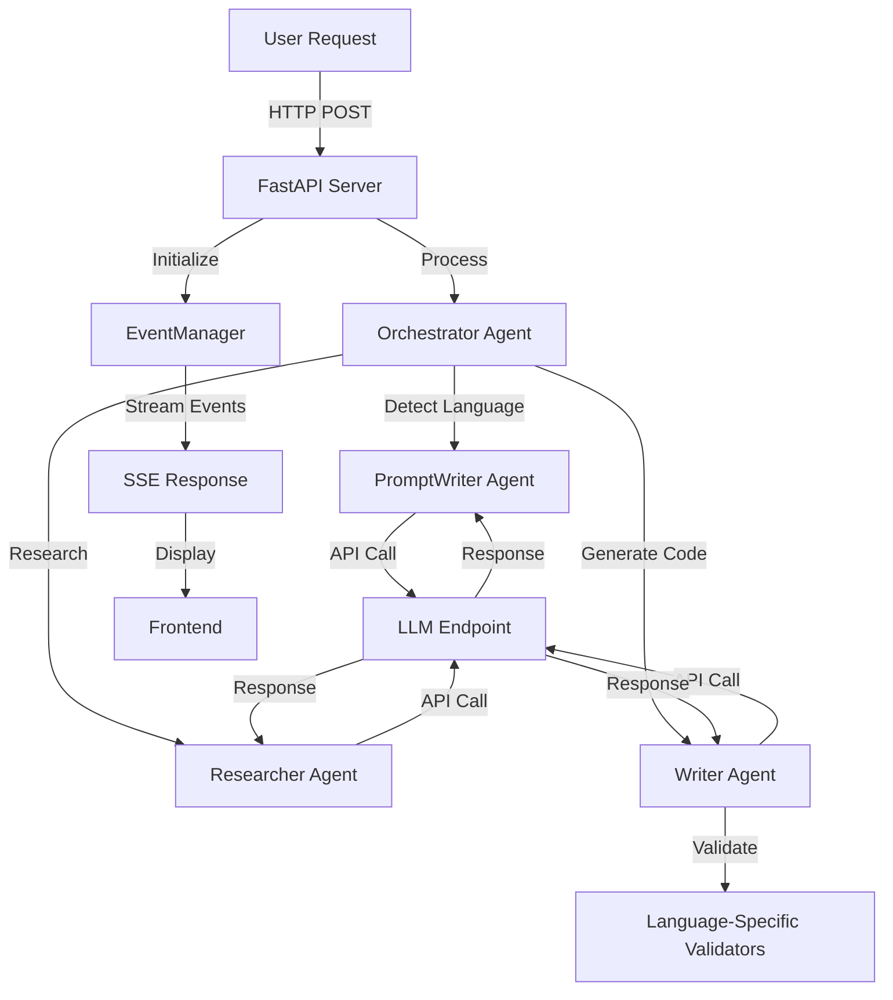

# AG-UI Test Application Documentation

## Purpose
This application was created as a learning exercise to understand and demonstrate the Agent User Interaction (AG_UI) Protocol. The application serves as a practical example of how to integrate AG_UI into an agent-based system, focusing on real-time communication between agents and users through a structured event system.

## AG_UI Protocol Overview
The Agent User Interaction (AG_UI) Protocol provides a standardized way for agents to communicate with users through a structured event system. This application implements AG_UI to demonstrate real-time, streaming interactions between the agent system and the user interface.

### Core Components
1. **Event System**
   - Uses Server-Sent Events (SSE) for real-time communication
   - Implements the AG_UI event hierarchy from the protocol
   - Supports streaming responses with proper event sequencing
   - Features enhanced events with structured metadata and performance tracking

2. **Event Types**
   - `RUN_STARTED`: Signals the beginning of an agent run with enhanced metadata
   - `RUN_FINISHED`: Signals the completion of an agent run with performance metrics
   - `TEXT_MESSAGE_START`: Indicates the start of a text message
   - `TEXT_MESSAGE_CONTENT`: Contains the actual message content
   - `TEXT_MESSAGE_END`: Signals the end of a text message
   - `RUN_ERROR`: Handles error conditions during execution
   - Enhanced events with correlation tracking and sequence validation

3. **Message Flow**
   ```mermaid
   sequenceDiagram
       participant U as User
       participant F as Frontend
       participant S as Server
       participant O as Orchestrator
       participant P as PromptWriter
       participant R as Researcher
       participant W as Writer
       participant V as Validator

       U->>F: Send Request
       F->>S: POST /awp
       S->>O: Process Request
       O->>P: Detect Language
       P-->>O: Language Identified
       O->>R: Research Requirements
       R-->>O: Research Results
       O->>W: Generate Code
       W->>V: Validate Code
       V-->>W: Validation Results
       W-->>O: Generated Code
       O-->>S: Response
       S-->>F: SSE Events
       F-->>U: Display Result
   ```

4. **Protocol Implementation**
   - Uses FastAPI for the web server
   - Implements streaming responses using `StreamingResponse`
   - Uses structured event classes with Pydantic models
   - Manages message IDs and correlation IDs for tracking conversations
   - Provides comprehensive error handling and recovery mechanisms
   - Demonstrates proper event sequencing with EventManager

5. **Key Features**
   - Real-time streaming of agent responses
   - Structured event-based communication with enhanced metadata
   - Support for multiple message types and validation
   - Advanced error handling and recovery
   - Thread and run tracking with performance metrics
   - State management with correlation tracking
   - Multi-agent coordination system
   - Language-specific code generation and validation

## System Architecture

The application implements a sophisticated multi-agent system with the following components:

### Agent System


### Agent Components

#### 1. Orchestrator Agent
- **Purpose**: Coordinates between all agents and manages workflow
- **Capabilities**: ["coordination", "workflow_management"]
- **Functions**:
  - Routes simple requests directly to Writer
  - Manages complex requests through research phase
  - Handles message ID and correlation ID generation
  - Manages SSE event streaming and error handling

#### 2. PromptWriter Agent  
- **Purpose**: Generates language-specific prompts and detects programming languages
- **Capabilities**: ["prompt_generation", "language_detection"]
- **Language Detection Patterns**:
  - **VB.NET**: `MessageBox.Show`, `Public Class`, `End Class`, `End Sub`
  - **Python**: `def`, `import`, `print(`, `if.*:`
  - **JavaScript**: `function`, `const`, `let`, `console.log`
  - **C#**: `public class`, `Console.WriteLine`, `using System`
- **Functions**:
  - `identify_language()`: Detects programming language from input
  - `generate_research_prompt()`: Creates research prompts
  - `generate_code_prompt()`: Creates code generation prompts

#### 3. Researcher Agent
- **Purpose**: Researches best practices and patterns for programming languages
- **Capabilities**: ["research", "analysis"]
- **Functions**:
  - Provides language-specific best practices
  - Analyzes requirements and suggests patterns
  - Returns structured JSON with summary, critical points, and examples
  - Supports all detected programming languages

#### 4. Writer Agent
- **Purpose**: Generates and validates code based on requirements
- **Capabilities**: ["code_generation", "validation"]
- **Functions**:
  - Generates safe and idiomatic code
  - Validates code safety using language-specific validators
  - Checks module dependencies and requirements
  - Implements retry logic for LLM API calls
  - Special handling for VB.NET code generation

### Code Validation System

#### Base CodeValidator
- Generic code safety validation
- Detects dangerous patterns across languages (os.system, eval, exec, etc.)
- Path traversal and security checks

#### Language-Specific Validators

**PythonValidator**:
- AST (Abstract Syntax Tree) validation
- Python-specific syntax checking
- Import validation

**VBValidator**: 
- VB.NET syntax pattern validation
- Required structure checking (Public Class, End Class)
- VB.NET-specific safety checks

## Configuration System

The application uses a sophisticated configuration system with environment variables:

### Environment Variables

#### Core Configuration
```bash
# API Keys (only required for cloud endpoints)
OPENAI_API_KEY=your_openai_key_here

# Researcher Agent Configuration
RESEARCHER_LLM_ENDPOINT=http://localhost:1234/v1/chat/completions
RESEARCHER_LLM_IS_LOCAL=true
RESEARCHER_LLM_MODEL=mimo-vl-7b-rl
RESEARCHER_LLM_TEMPERATURE=0.7
RESEARCHER_LLM_MAX_TOKENS=2000
RESEARCHER_LLM_TIMEOUT=500

# Writer Agent Configuration  
WRITER_LLM_ENDPOINT=http://localhost:1234/v1/chat/completions
WRITER_LLM_IS_LOCAL=true
WRITER_LLM_MODEL=mimo-vl-7b-rl
WRITER_LLM_TEMPERATURE=0.4
WRITER_LLM_MAX_TOKENS=2000
WRITER_LLM_TIMEOUT=500

# PromptWriter Agent Configuration
PROMPT_WRITER_LLM_ENDPOINT=http://localhost:1234/v1/chat/completions
PROMPT_WRITER_LLM_IS_LOCAL=true
PROMPT_WRITER_LLM_MODEL=mimo-vl-7b-rl
PROMPT_WRITER_LLM_TEMPERATURE=0.5
PROMPT_WRITER_LLM_MAX_TOKENS=2000
PROMPT_WRITER_LLM_TIMEOUT=500
```

### LLM Configuration Structure

```python
class LLMConfig(BaseModel):
    endpoint: str                    # API endpoint URL
    api_key: Optional[str] = None   # API key (None for local)
    model: str                      # Model name
    temperature: float = 0.7        # Response randomness
    max_tokens: int = 2000         # Maximum response tokens
    timeout: int = 30              # Request timeout
    headers: Dict[str, str] = {}   # Additional headers
    is_local: bool = False         # Local vs cloud endpoint
```

### Configuration Features
- **Automatic Endpoint Detection**: Sets appropriate endpoints based on `is_local` flag
- **Environment Variable Validation**: Comprehensive logging and validation
- **Default Value Handling**: Sensible defaults for missing configurations
- **Multi-Agent Support**: Separate configurations for each agent type
- **Timeout Management**: Configurable timeouts for different operations

## Enhanced Event System

### Event Hierarchy
```python
BaseEvent
├── RunEvent
│   ├── RunStartedEvent (Enhanced with metadata)
│   ├── RunFinishedEvent (With performance metrics)
│   └── RunErrorEvent
├── MessageEvent
│   ├── TextMessageStartEvent
│   ├── TextMessageContentEvent
│   ├── TextMessageEndEvent
│   └── TextMessageErrorEvent
├── ToolEvent
├── StateEvent
├── ContextEvent
└── ControlEvent
```

### Enhanced RunStartedEvent Features
- **Structured Agent Metadata**: Name, description, version, capabilities
- **Environment Information**: System details, memory usage, platform info
- **LLM Configuration Tracking**: Endpoint details for each agent
- **Performance Tracking**: Expected duration, start time, priority
- **Runtime Settings**: Timeout configurations, tool availability

### Event Management
- **EventManager Class**: Validates, sequences, and correlates events
- **Sequence Validation**: Ensures proper event ordering
- **Correlation Tracking**: Links related events across the workflow
- **Error Recovery**: Graceful handling of validation failures

### Performance Metrics in RunFinishedEvent
```python
performance_metrics = {
    # Timing metrics
    "total_time": elapsed_time,
    "actual_duration": duration_since_start,
    "expected_duration": estimated_duration,
    "duration_variance": actual_vs_expected_ratio,
    
    # Response metrics  
    "message_length": response_character_count,
    "response_words": word_count,
    "message_quality_score": quality_heuristic,
    
    # System metrics
    "memory_usage_mb": memory_consumption,
    "cpu_percent": cpu_utilization,
    
    # Agent utilization
    "agents_used": ["orchestrator", "researcher", "writer"],
    "capabilities_utilized": capability_list,
    "tools_used": enabled_tools,
    
    # Performance classification
    "performance_tier": "fast|normal|slow",
    "success_rate": completion_percentage,
    "error_count": error_occurrences
}
```

## Request and Response Flow

### 1. Request Format
```json
{
    "thread_id": "uuid-string",
    "run_id": "uuid-string", 
    "messages": [
        {
            "role": "user",
            "content": "Generate a VB.NET MessageBox example"
        }
    ]
}
```

### 2. Event Sequence
1. **RUN_STARTED**: Enhanced event with agent metadata and configuration
2. **TEXT_MESSAGE_START**: Begin response message
3. **Agent Processing**:
   - Language detection via PromptWriter
   - Research phase (for complex requests)
   - Code generation with validation
4. **TEXT_MESSAGE_CONTENT**: Stream generated response
5. **TEXT_MESSAGE_END**: Complete message
6. **RUN_FINISHED**: Performance metrics and completion status

### 3. Error Handling
- **Graceful Degradation**: Continue processing despite individual agent failures
- **Comprehensive Error Events**: Detailed error information with context
- **Recovery Mechanisms**: Retry logic for LLM API timeouts
- **Stream Maintenance**: Proper event sequences even during errors

## Benefits of Using AG_UI

### 1. Standardized Multi-Agent Communication
- Consistent protocol across different agent types
- Structured event correlation for complex workflows
- Enhanced metadata for better debugging and monitoring

### 2. Real-Time Multi-Modal Interaction
- Streaming responses with performance tracking
- Language-specific code generation
- Dynamic validation and error correction

### 3. Enterprise-Ready Architecture
- Comprehensive configuration management
- Performance monitoring and metrics
- Scalable multi-agent coordination
- Robust error handling and recovery

### 4. Enhanced Development Experience
- Language detection and appropriate prompt generation
- Structured research integration
- Code validation with safety checks
- Clear event tracing and debugging support

## Language Support

### Currently Supported Languages
1. **VB.NET**
   - MessageBox integration
   - XML documentation
   - VB.NET-specific syntax validation
   - Framework 4.7.2 compatibility

2. **Python** 
   - AST validation
   - Module import checking
   - Python-specific safety patterns

3. **JavaScript**
   - ES6+ feature support
   - Module system integration
   - Modern JavaScript patterns

4. **C#**
   - .NET framework integration
   - Using statement management
   - XML documentation support

### Language Detection Process
1. **Explicit Keywords**: Direct language mentions in user input
2. **Syntax Pattern Matching**: Language-specific code patterns
3. **Context Analysis**: Code structure and naming conventions
4. **Default Handling**: Graceful fallback for unknown languages

## Setup Instructions

### 1. Environment Setup
```bash
# Clone the repository
git clone <repository-url>
cd AG_UI_Test

# Install Python dependencies
pip install -r requirements.txt

# Create .env file with configuration
cp .env.example .env
# Edit .env with your LLM endpoints and settings
```

### 2. Configuration
- Set up local LLM endpoint (e.g., LM Studio on port 1234)
- Configure environment variables in `.env`
- Verify LLM connectivity and model availability

### 3. Running the Application
```bash
# Start the FastAPI server
python main.py

# Access the application
# Frontend: http://localhost:8000
# API Documentation: http://localhost:8000/docs
```

### 4. Testing
```bash
# Test with curl
curl -X POST "http://localhost:8000/awp" \
  -H "Content-Type: application/json" \
  -d '{
    "thread_id": "test-123",
    "run_id": "run-456", 
    "messages": [{"role": "user", "content": "Create a VB.NET hello world"}]
  }'
```

## Error Handling and Troubleshooting

### Common Issues
1. **LLM Endpoint Connectivity**: Check endpoint URLs and local server status
2. **Configuration Errors**: Verify environment variables and .env file
3. **Timeout Issues**: Adjust timeout settings for your hardware
4. **Model Compatibility**: Ensure models support required features

### Debug Logging
The application provides comprehensive debug logging:
- Configuration validation
- Agent initialization
- Event processing and validation
- LLM API interactions
- Performance metrics

### Monitoring
- Real-time performance tracking in RunFinishedEvent
- Memory and CPU utilization monitoring
- Success/failure rate tracking
- Response quality metrics

## Future Enhancements

### Planned Features
1. **Additional Language Support**: Go, Rust, Java, TypeScript
2. **Enhanced Validation**: More sophisticated safety checks
3. **Performance Optimization**: Caching, parallel processing
4. **UI Improvements**: Better code formatting, syntax highlighting
5. **Advanced Analytics**: Usage patterns, performance trends

### Architecture Improvements
1. **Agent Plugins**: Extensible agent system
2. **Distributed Processing**: Multi-node agent coordination
3. **Enhanced Caching**: Intelligent response caching
4. **Advanced Monitoring**: Comprehensive observability

## Contributing

### Development Guidelines
1. Follow the existing agent pattern for new agents
2. Implement proper validation for new languages
3. Add comprehensive error handling
4. Include performance metrics in new features
5. Update documentation for any changes

### Code Standards
- Use Pydantic models for all data structures
- Implement proper typing throughout
- Add comprehensive logging
- Follow the existing event pattern
- Validate all inputs and outputs

## License
MIT License - See LICENSE file for details 