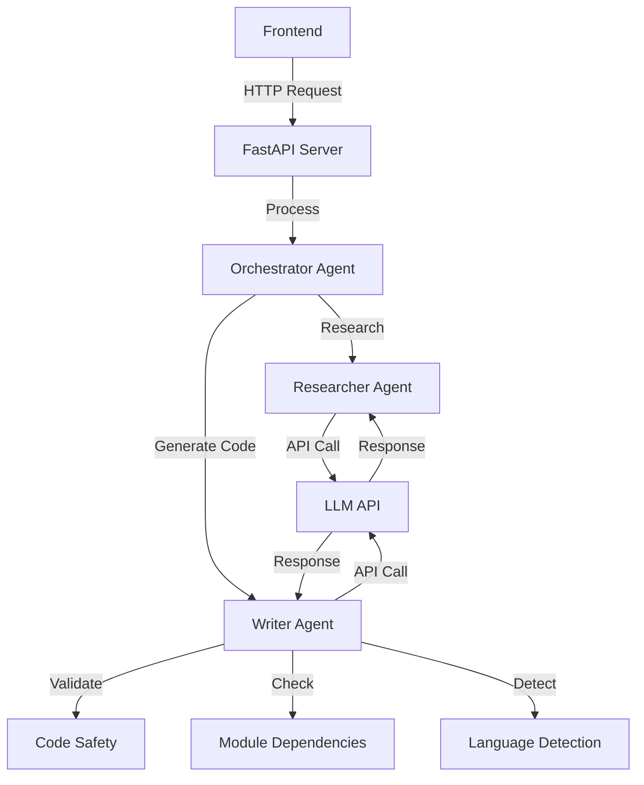
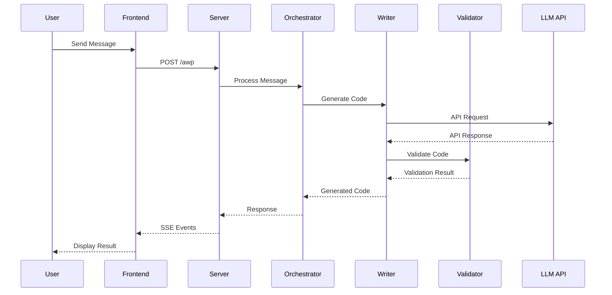
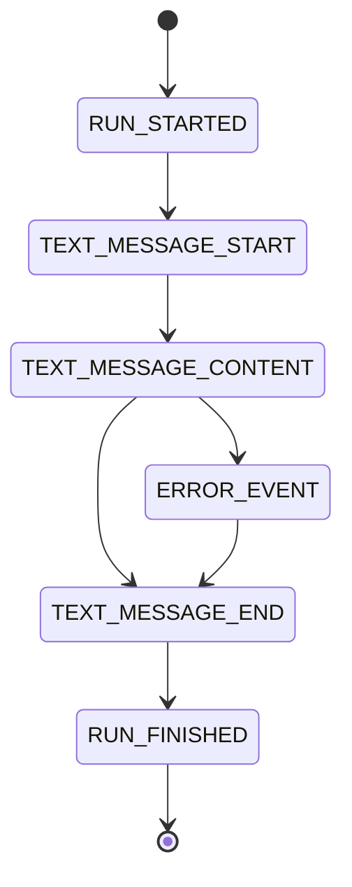
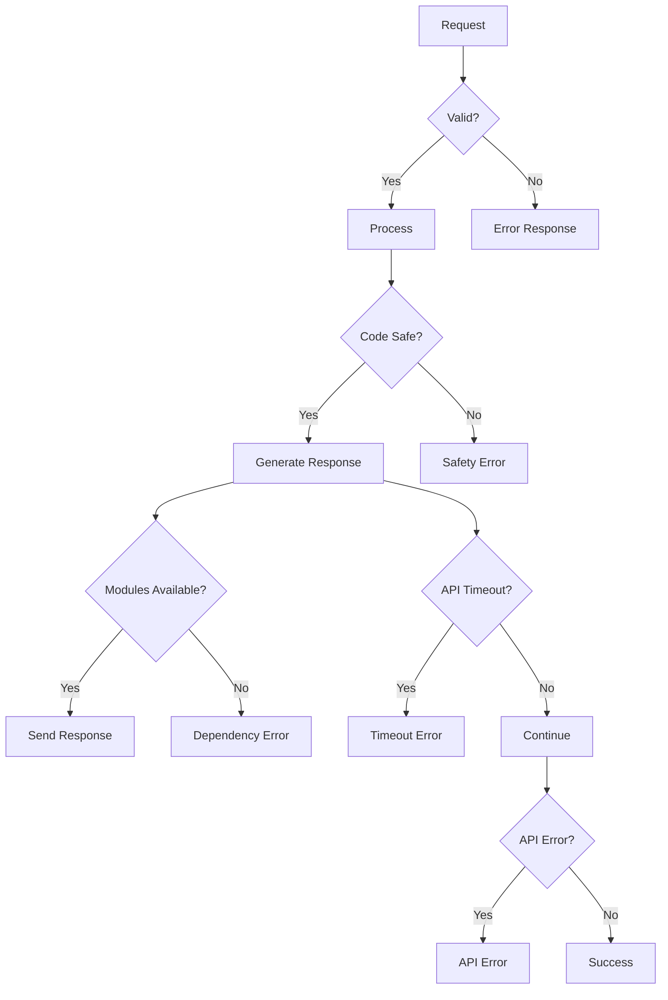

# AG-UI Test Application Documentation

## Purpose
This application was created via pure vibe-coding using Cursor.  I created it with the intention
of using this code to learn how AG_UI fits into the Agent Architecture.  The documentation.md 
is the actual output, as that served as my study guide once the code was generated.  In this way
I was able to quickly use this simple prototype to understand how AG_UI works.

## AG_UI Protocol Overview
The Agent User Interaction (AG_UI) Protocol is a standardized way for agents to communicate with users through a structured event system. This application implements the AG_UI protocol to provide real-time, streaming interactions between the agent system and the user interface.

### Core Components
1. **Event System**
   - Uses Server-Sent Events (SSE) for real-time communication
   - Implements a structured event hierarchy
   - Supports streaming responses with proper event sequencing

2. **Event Types**
   - `RUN_STARTED`: Signals the beginning of an agent run
   - `RUN_FINISHED`: Signals the completion of an agent run
   - `TEXT_MESSAGE_START`: Indicates the start of a text message
   - `TEXT_MESSAGE_CONTENT`: Contains the actual message content
   - `TEXT_MESSAGE_END`: Signals the end of a text message
   - `RUN_ERROR`: Handles error conditions during execution

3. **Message Flow**
   ```mermaid
   sequenceDiagram
       participant U as User
       participant F as Frontend
       participant S as Server
       participant A as AG_UI Protocol
       participant G as Agent System

       U->>F: Send Request
       F->>S: POST /awp
       S->>A: Initialize Event Stream
       A->>G: Process Request
       G-->>A: Generate Events
       A-->>S: Stream Events
       S-->>F: SSE Response
       F-->>U: Update UI
   ```

4. **Protocol Implementation**
   - Uses FastAPI for the web server
   - Implements streaming responses using `StreamingResponse`
   - Handles event formatting through `EventEncoder`
   - Manages message IDs for tracking conversations
   - Provides error handling and recovery mechanisms

5. **Key Features**
   - Real-time streaming of agent responses
   - Structured event-based communication
   - Support for multiple message types
   - Error handling and recovery
   - Thread and run tracking
   - State management

6. **Integration Points**
   - Frontend: Receives and processes SSE events
   - Backend: Generates and streams events
   - Agent System: Produces content for events
   - Error Handling: Manages and reports issues

### Event Processing Flow
1. User request received
2. Generate unique message ID
3. Initialize event stream
4. Process request through agent system
5. Stream events in real-time
6. Handle completion or errors
7. Close event stream

### Error Handling
- Graceful error recovery
- Error event propagation
- Stream maintenance during errors
- User feedback for issues

## Benefits of Using AG_UI

### 1. Standardized Communication
- Provides a consistent protocol for agent-user interactions
- Eliminates the need for custom communication protocols
- Ensures compatibility across different agent implementations
- Simplifies integration with various frontend frameworks

### 2. Real-Time Interaction
- Enables streaming responses for immediate user feedback
- Supports token-by-token output for dynamic UIs
- Maintains low-latency communication
- Allows for interactive user experiences

### 3. Flexible Integration
- Works with any transport layer (HTTP, SSE, WebSockets)
- Supports multiple agent frameworks (LangGraph, CrewAI, Mastra)
- Enables easy switching between different LLM providers
- Provides framework-agnostic frontend contracts

### 4. Enhanced Development Experience
- Reduces development time by eliminating custom adapters
- Provides clear event schemas for better debugging
- Enables easier testing and replay of agent interactions
- Simplifies maintenance and updates

### 5. Enterprise Readiness
- Built-in support for CORS and authentication
- Comprehensive error handling and recovery
- Support for audit logging and monitoring
- Scalable architecture for production deployments

### 6. State Management
- Efficient handling of dynamic content updates
- Support for state diffs to minimize bandwidth
- Maintains context across multiple interactions
- Enables complex multi-turn conversations

### 7. Tool Integration
- Structured interface for function execution
- Support for tool calls and results
- Enables agent-initiated actions
- Maintains tool execution context

### 8. Security and Control
- Built-in security features for enterprise use
- Support for authentication and authorization
- Control primitives for managing user interactions
- Safe handling of concurrent operations

## Overview
This application implements the Agent User Interaction Protocol (AG-UI) for generating code in multiple programming languages. It features a multi-agent system with robust code generation, safety validation, and language detection capabilities.

## System Components



## Configuration

### Environment Setup
- Requires `.env` file in the application root
- Environment variables for LLM configuration:
  - `LLM_API_KEY`: API key for cloud endpoints
  - `LLM_ENDPOINT`: API endpoint URL
  - `LLM_MODEL`: Model name to use
  - `LLM_IS_LOCAL`: Boolean flag for local endpoint

### LLM Configuration
- Supports both local and cloud endpoints
- Configurable timeout settings:
  - Response timeout: 300 seconds
  - Connect timeout: 10 seconds
  - Read timeout: 600 seconds
  - Write timeout: 10 seconds
- Connection limits:
  - Max keepalive connections: 5
  - Max total connections: 10
- Retry logic: 3 attempts for failed requests

## Enhanced Features

### Code Generation
- **Smart Code Templates**: Pre-defined templates for common requests
- **Dynamic Code Generation**: Custom code generation for specific requirements
- **Markdown Formatting**: Properly formatted code blocks with language specification
- **Multi-line Support**: Preserves code formatting and indentation
- **Main Guard**: Includes `if __name__ == "__main__":` pattern
- **Error Handling**: Comprehensive try-except blocks
- **Language-Specific Features**: 
  - VB.NET: MessageBox.Show integration, XML documentation
  - Python: AST validation, module imports
  - JavaScript: ES6+ features, module system
  - C#: .NET framework integration

### Safety Features
- **AST Validation**: Syntax validation using Python's Abstract Syntax Tree
- **Dangerous Operation Detection**: Blocks potentially harmful code patterns
- **Module Dependency Checking**: Verifies required modules are available
- **Requirement Validation**: Ensures generated code meets user requirements
- **Timeout Protection**: Prevents hanging on long-running operations
- **Connection Limits**: Prevents resource exhaustion
- **Language-Specific Validation**:
  - VB.NET: Syntax patterns, MessageBox usage
  - Python: AST parsing, import validation
  - JavaScript: Syntax checking
  - C#: Framework validation

### Language Detection
- **Multi-language Support**: Detects VB.NET, Python, JavaScript, and C#
- **Pattern Recognition**: Identifies language based on syntax patterns
- **Code Block Extraction**: Properly extracts code from markdown blocks
- **Language Specification**: Maintains language context in responses
- **VB.NET Detection**: 
  - MessageBox.Show patterns
  - Public/Private class declarations
  - End Class/Sub patterns
- **Python Detection**:
  - def/import statements
  - Python-specific syntax
- **JavaScript Detection**:
  - function declarations
  - ES6+ features
- **C# Detection**:
  - class declarations
  - using statements

## Message Flow



## Event Types



## Error Handling



## Frontend Components
- **Message Display**: Real-time message updates
- **Code Formatting**: Syntax highlighting for code blocks
- **Error Handling**: Clear error message display
- **Streaming Support**: Server-Sent Events (SSE) implementation

## Backend Components

### Orchestrator Agent
- Coordinates between agents
- Manages workflow
- Routes simple requests directly to Writer
- Handles complex requests with research phase
- Manages message ID generation
- Handles SSE event streaming

### Researcher Agent
- Provides best practices
- Suggests patterns
- Analyzes requirements
- Supports code generation decisions
- Manages LLM API interactions
- Handles API timeouts and retries
- Language-agnostic research capabilities

### Writer Agent
- Generates code based on requirements
- Validates code safety
- Checks module dependencies
- Detects programming language
- Formats code with markdown
- Implements retry logic
- Manages LLM API interactions
- Handles API timeouts and retries
- Specialized handling for VB.NET code generation

### PromptWriter Agent
- Generates language-specific prompts
- Detects programming language from input
- Creates appropriate research prompts
- Generates code generation prompts
- Supports multiple languages:
  - VB.NET
  - Python
  - JavaScript
  - C#

### Code Validation
- Base `CodeValidator` class for common validation
- Language-specific validators:
  - `VBValidator`: VB.NET specific validation
  - `PythonValidator`: Python specific validation
  - Extensible for other languages
- Safety checks for each language
- Syntax pattern validation
- Framework-specific validation

## Event Flow
1. User sends message
2. Server receives request
3. Generate unique message ID
4. Send RUN_STARTED event
5. Send TEXT_MESSAGE_START event
6. Orchestrator processes message
7. Writer generates and validates code
8. Send TEXT_MESSAGE_CONTENT events
9. Send TEXT_MESSAGE_END event
10. Send RUN_FINISHED event
11. Frontend displays formatted result

## Request Format
```json
{
    "thread_id": "uuid",
    "run_id": "uuid",
    "messages": [
        {
            "role": "user",
            "content": "message content"
        }
    ]
}
```

## Error Handling
- Syntax validation errors
- Safety check failures
- Missing module dependencies
- Invalid language detection
- Stream processing errors
- LLM API timeouts
- LLM API connection errors
- Environment configuration errors
- Invalid message format errors
- Language-specific validation errors

## Setup Instructions
1. Install dependencies: `pip install -r requirements.txt`
2. Create `.env` file with required configuration
3. Start server: `python main.py`
4. Access frontend: `http://localhost:8000`

## Future Improvements
- Enhanced language detection
- Additional code templates
- Extended safety checks
- Improved error messages
- Better code formatting
- Enhanced timeout handling
- Improved retry logic
- Better environment validation
- Additional language support
- Enhanced VB.NET features

## Contributing
1. Fork the repository
2. Create feature branch
3. Commit changes
4. Push to branch
5. Create Pull Request

## License
MIT License - See LICENSE file for details 